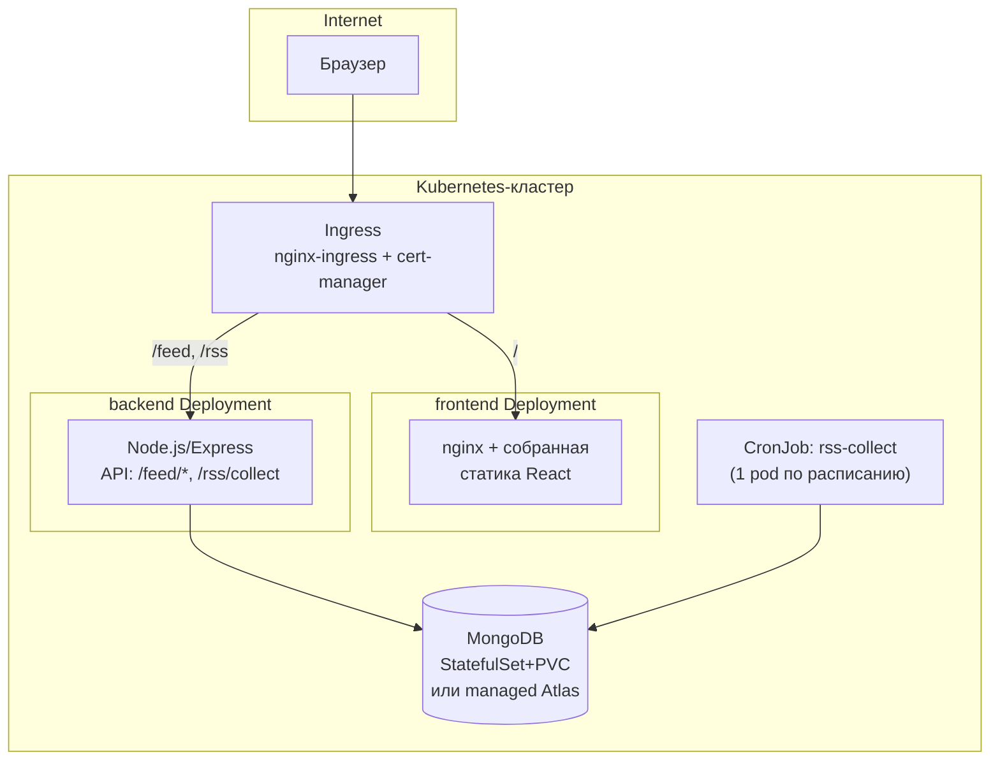

# DevPulse — миграция на Docker/Kubernetes

Статус: план (ничего из этого ещё не реализовано в репозитории — этот файл описывает
целевую архитектуру и шаги к ней).

Это расширяет/заменяет черновой план в Obsidian
(`Digital Ai Project/Plan/11 Deployment Infra`), который предполагал Docker Compose + Postgres.
Реальный стек другой — MongoDB, Express/TS backend, React/Vite frontend, — план ниже написан
под него и сразу целится в Kubernetes, а не только Compose.

## 0. Текущее состояние (для контекста)

```
backend/   Express + TS, порт 3000, MongoDB (Mongoose), RSS-сбор через node-cron
           внутри самого процесса (SchedulerService.start() в index.ts)
frontend/  React + Vite, статическая SPA, в dev — proxy /feed и /rss на backend:3000
```

Важно: **сейчас планировщик (node-cron) живёт внутри API-процесса**. Это первое, что
придётся изменить перед Kubernetes — см. §2.

## 1. Целевая архитектура



Ключевая идея: **один Ingress-хост, path-based роутинг** (`/` → frontend, `/feed*`/`/rss*` →
backend). Это то же самое, что сейчас делает Vite dev-proxy локально — фронтенд как ходил
относительными путями (`fetch('/feed/items')`), так и продолжит, без переключения на
CORS/абсолютные URL и без правок кода фронтенда при переходе в прод.

## 2. Главное архитектурное изменение: разделить API и планировщик

Сейчас `SchedulerService` (node-cron) стартует внутри того же процесса, что и Express-сервер
(`src/index.ts`). Это нормально для одного процесса на локальной машине, но ломается при
горизонтальном масштабировании backend в Kubernetes: **каждая реплика Deployment'а запустит
свой независимый cron** → N параллельных сборов RSS одновременно, дублирующиеся запросы к
источникам, гонки за одни и те же статьи в Mongo.

Решение — вынести сбор в **Kubernetes CronJob**, отдельный от Deployment'а API:

1. Добавить в backend новый CLI-энтрипоинт (по образцу уже существующего `bin/extract.ts`):
   `bin/collect.ts` — поднимает DI-контейнер **без Express** (`bootstrap()` без `app.listen`),
   вызывает `rssCollectorService.collect()` один раз и завершает процесс (`process.exit(0)`).
2. В `Dockerfile` backend этот файл собирается в `dist/bin/collect.js` как альтернативная
   точка входа того же образа (один образ — два способа запуска: `node dist/index.js` для API,
   `node dist/bin/collect.js` для сбора).
3. `SchedulerService`/`node-cron` остаётся только для локальной разработки (`dev.sh`,
   `docker-compose`) — в production-манифестах Kubernetes переменная типа
   `ENABLE_IN_PROCESS_SCHEDULER=false` отключает `schedulerService.start()` в `index.ts`,
   т.к. расписание теперь задаёт `CronJob.spec.schedule`, а не `RSS_CRON_SCHEDULE` в контейнере API.
4. `GET /rss/collect` в API остаётся как есть — это ручной триггер для кнопки
   «Обновить дайджест» на фронтенде, отдельно от автоматического CronJob.
5. `CronJob` — `concurrencyPolicy: Forbid` (не запускать новый прогон, пока предыдущий не
   закончился) + разумный `activeDeadlineSeconds`, чтобы зависший прогон не висел вечно.

После этого backend Deployment становится полностью stateless между запросами (никакого
in-memory состояния между репликами) и **безопасно масштабируется горизонтально** — это
дополнительный плюс рефакторинга, не только требование для CronJob.

## 3. Docker-образы

Два независимых multi-stage образа (соответствует уже сделанному разделению `backend/` /
`frontend/` на верхнем уровне репозитория):

**`backend/Dockerfile`** (Node, multi-stage):
- stage `build`: `npm ci`, `npm run build` (tsc → `dist/`)
- stage `runtime`: только `dist/`, `node_modules` (prod-зависимости), `package.json`;
  `USER node` (не root); `CMD ["node", "dist/index.js"]`
- тот же образ используется CronJob'ом с `command: ["node", "dist/bin/collect.js"]`
  (см. §2) — не нужен отдельный образ под сбор

**`frontend/Dockerfile`** (multi-stage):
- stage `build`: `npm ci`, `npm run build` (Vite → статика в `dist/`)
- stage `runtime`: `nginx:alpine`, копируем `dist/` в `/usr/share/nginx/html`,
  свой `nginx.conf` (SPA fallback на `index.html` для клиентского роутинга, если он появится)

`.dockerignore` в обеих папках: `node_modules`, `dist`, `.env*`.

## 4. Docker Compose — промежуточный шаг перед Kubernetes

Прежде чем писать k8s-манифесты, стоит проверить оба образа локально через Compose —
тот же набор сервисов, что потом станет Deployment'ами/CronJob'ом, но без кластера:

```yaml
services:
  mongo:
    image: mongo:7
    volumes: ["mongodata:/data/db"]
    environment:
      MONGO_INITDB_ROOT_USERNAME: ${MONGO_INITDB_ROOT_USERNAME}
      MONGO_INITDB_ROOT_PASSWORD: ${MONGO_INITDB_ROOT_PASSWORD}

  backend:
    build: ./backend
    env_file: ./backend/.env
    depends_on: [mongo]
    ports: ["3000:3000"]

  frontend:
    build: ./frontend
    depends_on: [backend]
    ports: ["8080:80"]

  rss-collect:
    build: ./backend
    command: ["node", "dist/bin/collect.js"]
    env_file: ./backend/.env
    depends_on: [mongo]
    profiles: ["cron"]   # запускается вручную/по cron хоста, не при `docker compose up`

volumes:
  mongodata:
```

`docker compose up` — поднимает то же самое, что сейчас `dev.sh`, но в контейнерах.

## 5. Kubernetes-манифесты — структура репозитория

```
infra/
  docker/
    backend.Dockerfile
    frontend.Dockerfile
    frontend-nginx.conf
  docker-compose.yml
  k8s/
    base/
      backend-deployment.yaml
      backend-service.yaml
      frontend-deployment.yaml
      frontend-service.yaml
      rss-collect-cronjob.yaml
      configmap.yaml
      secret.example.yaml       # шаблон, реальный secret НЕ коммитится
      ingress.yaml
      kustomization.yaml
    overlays/
      dev/
        kustomization.yaml      # 1 реплика, resource limits поменьше
      prod/
        kustomization.yaml      # N реплик, HPA, свой ingress host/TLS
```

Kustomize (base + overlays) — чтобы не дублировать манифесты между окружениями; альтернатива
Helm, если понадобятся параметризуемые чарты для внешних пользователей — для одного личного
проекта Kustomize проще.

### Ключевые объекты

- **ConfigMap** (`backend-config`): `RSS_FEEDS` (тот же JSON, что сейчас в `.env`), `PORT`,
  `NODE_ENV=production`. Без секретов.
- **Secret** (`backend-secret`, из `secret.example.yaml`-шаблона, реальный — через
  `kubectl create secret` / Sealed Secrets / External Secrets Operator, не в git): `MONGO_URI`.
- **backend Deployment**: `replicas: 2+`, `livenessProbe`/`readinessProbe` на `GET /health`
  (эндпоинта пока нет — нужно добавить, см. §6), resource `requests`/`limits`.
- **backend Service**: `ClusterIP`, порт 3000 — наружу не торчит напрямую, только через Ingress.
- **frontend Deployment** + **Service**: аналогично, порт 80 (nginx).
- **CronJob** `rss-collect`: `schedule: "0 * * * *"` (перенесённое сюда значение из
  `RSS_CRON_SCHEDULE`), `concurrencyPolicy: Forbid`, `restartPolicy: OnFailure`,
  использует тот же backend-образ + тот же `backend-secret`/`backend-config`.
- **Ingress**: один host, path-routing `/` → frontend-service, `/feed`, `/rss` →
  backend-service; TLS через `cert-manager` (Let's Encrypt).

## 6. Что нужно доделать в коде перед этим (пререквизиты)

- [ ] `GET /health` в backend — проверяет `mongoose.connection.readyState`, отдаёт 200/503.
      Нужен для liveness/readiness проб. (Уже был TODO на это в `index.ts`.)
- [ ] `bin/collect.ts` — CLI-точка входа для CronJob (см. §2), по образцу `bin/extract.ts`.
- [ ] Флаг `ENABLE_IN_PROCESS_SCHEDULER` (default `true` для локальной разработки) вокруг
      вызова `schedulerService.start()` в `index.ts`.
- [ ] `Dockerfile` для `backend/` и `frontend/`, `.dockerignore` в обеих папках.
- [ ] Graceful shutdown в `index.ts` (`SIGTERM` → `server.close()` + `mongoose.disconnect()`)
      — иначе Kubernetes будет убивать под жёстко при каждом рестарте/деплое.

## 7. MongoDB: self-hosted или managed

| | Self-hosted (StatefulSet + PVC в кластере) | Managed (MongoDB Atlas / облачный managed Mongo) |
|---|---|---|
| Плюсы | Всё в одном месте, бесплатно (кроме диска) | Бэкапы, HA, патчи — не твоя забота |
| Минусы | Бэкапы/восстановление/апгрейды — на тебе | Отдельный счёт, данные вне кластера |
| Когда ок | Обучение, pet-проект, staging | Production, если не хочется управлять БД руками |

Для личного pet-проекта уровня DevPulse — начать с self-hosted StatefulSet, при желании
позже мигрировать на managed без изменений в коде (меняется только `MONGO_URI` в Secret).

## 8. Хостинг: dev/prod-серверы (Hetzner Cloud)

Провайдер — **Hetzner Cloud** (выбран по цене; для остальных вариантов см. сравнение
в отдельной переписке — AWS/DigitalOcean заметно дороже за те же ресурсы). Оплата в EUR,
нужна карта не из РФ.

Минимальная конфигурация — два отдельных сервера, оба на самом дешёвом сейчас плане
**CX22** (2 vCPU, 4 GB RAM, 40 GB NVMe, 20 TB трафика, €3.79/мес каждый, курс EUR/USD
~1.16 на август 2026 → ~$4.4/мес за сервер):

| Сервер | Роль | Что на нём крутится | Цена/мес |
|---|---|---|---|
| **dev** | разработка/стейджинг | `docker compose up` из §4 (mongo + backend + frontend), без k8s | €3.79 (~$4.4) |
| **prod** | production | self-managed k3s (однонодовый, без managed control plane) — backend `replicas: 2` из §5, frontend, self-hosted MongoDB на том же узле | €3.79 (~$4.4) |
| **Итого** | | | **€7.58/мес (~$8.8/мес)** |

Почему так дёшево:
- **Никакого managed Kubernetes** (EKS/GKE и т.п.) — control plane поднимается сами
  (k3s), это не отдельная статья расходов, в отличие от, например, AWS EKS
  (~$74/мес только за control plane).
- **MongoDB self-hosted** на том же узле, а не Atlas — см. компромисс в §7: для
  pet-проекта на старте это ок, бэкапы/апгрейды — на себе.
- Никакого отдельного Load Balancer — по одному публичному IP на сервер, Ingress
  внутри k3s на prod.

Что в эту минимальную сумму **не входит** и стоит учитывать отдельно:
- Снапшоты/бэкапы диска — обычно +20% к цене сервера, если включить.
- Домен — отдельная покупка (~$10–15/год), TLS через cert-manager/Let's Encrypt бесплатно.
- Трафик сверх 20 TB/мес — маловероятно для pet-проекта такого масштаба.

Важный компромисс: **prod — одна нода**, значит нет отказоустойчивости control plane —
падение сервера роняет всё сразу. Для текущего масштаба (личный pet-проект) это
приемлемо; апгрейд до нескольких нод/managed-кластера — по мере роста нагрузки, без
изменений в манифестах из §5 (просто больше нод + `replicas` выше).

## 9. CI/CD (набросок)

1. GitHub Actions: на push в `main` — собрать оба образа (`docker build`), затегать
   `:sha-<commit>` и `:latest`, запушить в registry (GHCR — бесплатно для публичных/личных
   репо и уже привязан к GitHub-аккаунту).
2. Деплой: либо `kubectl apply -k infra/k8s/overlays/prod` из CI (простой вариант), либо
   GitOps (ArgoCD/Flux следит за репозиторием и сам синхронизирует кластер — правильнее для
   будущего, но лишняя инфраструктура для старта одного pet-проекта).
3. Для локальной проверки манифестов перед реальным кластером — `kind` или `minikube`:
   `kind create cluster`, `kubectl apply -k infra/k8s/overlays/dev`, проверить, что всё
   поднимается, прежде чем катить в настоящий кластер.

## 10. Порядок миграции (чек-лист)

- [ ] §6: health-check, `bin/collect.ts`, флаг планировщика, graceful shutdown
- [ ] Dockerfile'ы для backend и frontend, локальная сборка (`docker build`) без ошибок
- [ ] `docker-compose.yml` — полный локальный прогон (mongo+backend+frontend+ручной
      rss-collect), проверить, что фронтенд видит бэкенд через nginx/ingress-подобный путь
- [ ] Манифесты Kubernetes (`infra/k8s/base` + `overlays/dev`), поднять в `kind`/`minikube`
- [ ] Настроить Ingress + TLS локально (self-signed/`mkcert`) или сразу в staging-кластере
- [ ] CI: сборка и пуш образов в registry
- [ ] `overlays/prod`, реальный кластер, секреты через Sealed Secrets/External Secrets
- [ ] Бэкапы Mongo (если self-hosted) — CronJob с `mongodump` в объектное хранилище
- [ ] §8: заказать 2 сервера на Hetzner Cloud (CX22 × 2, dev + prod), поставить k3s на prod

Это соответствует финальному пункту общего плана DevPulse — Модуль 11 (Deployment & Infra,
v1.0) в Obsidian, только с Kubernetes вместо Docker Compose как целевой платформы.
